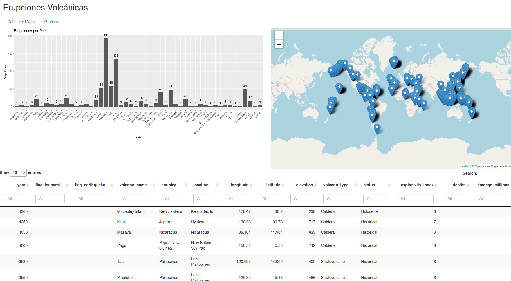
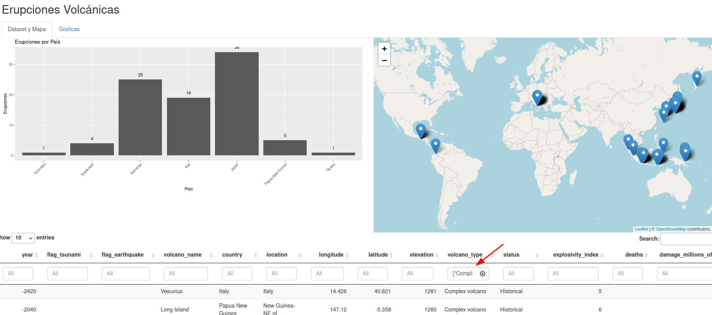
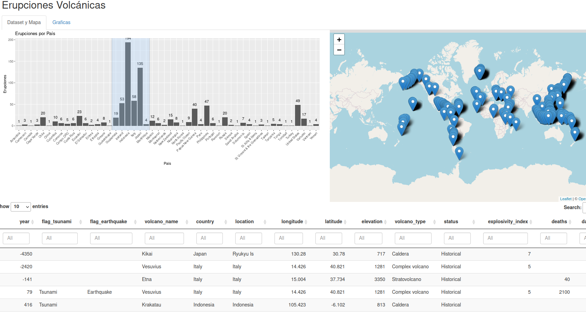
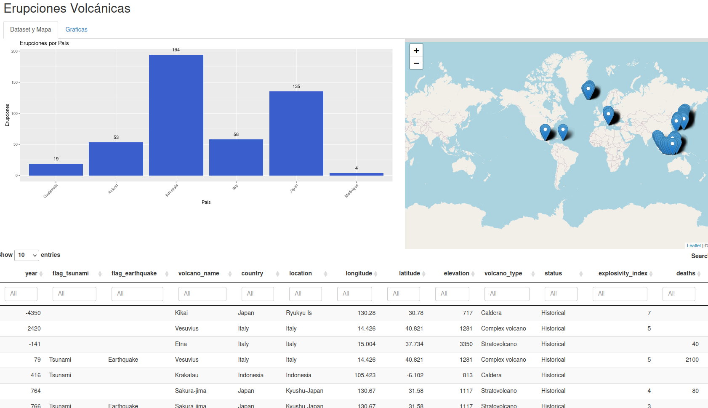
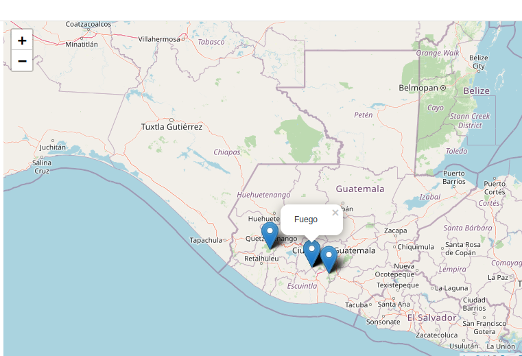
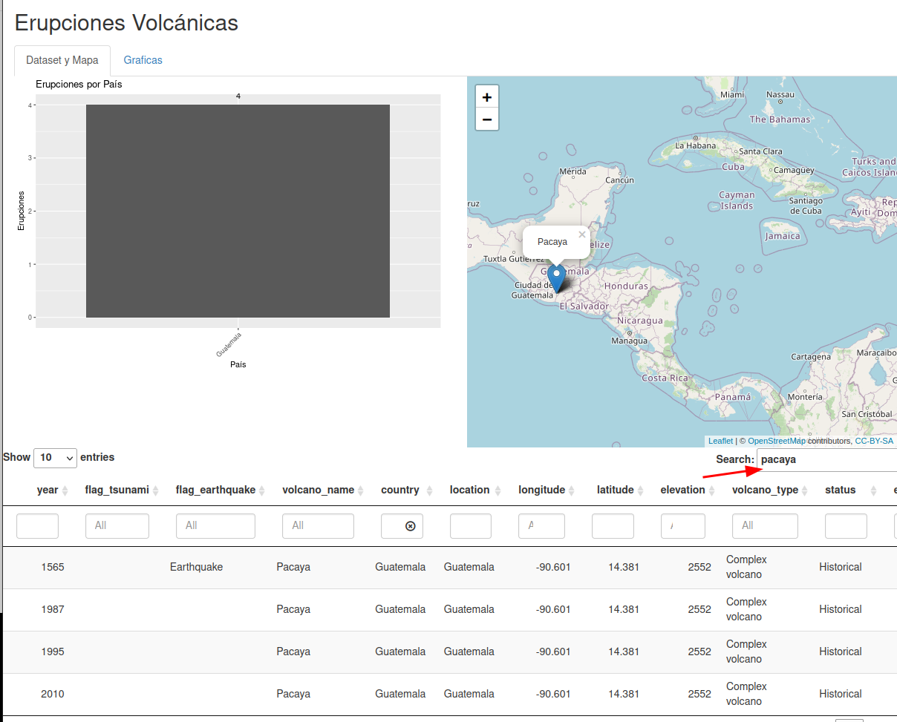
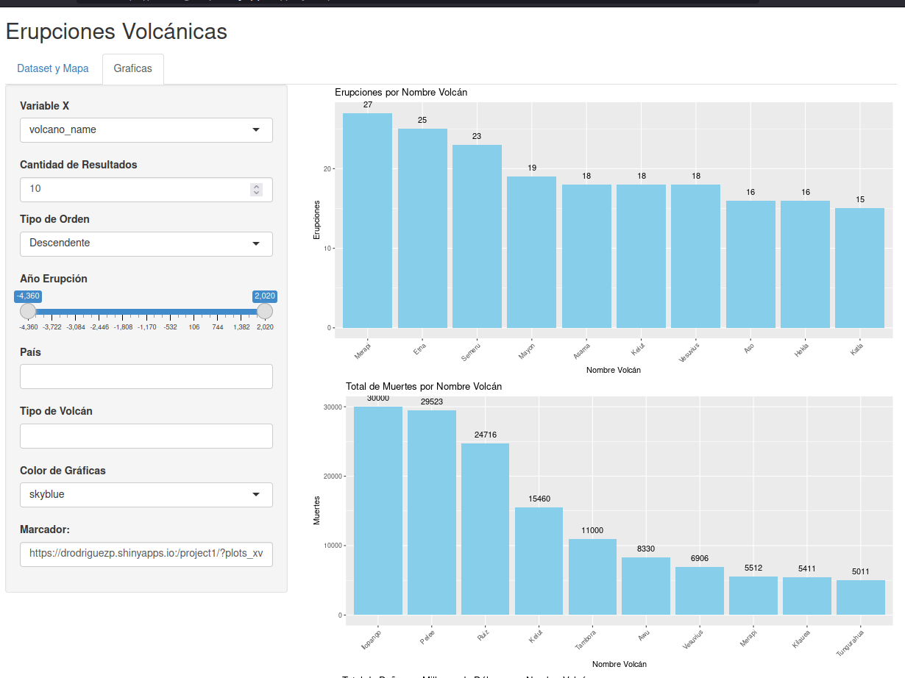
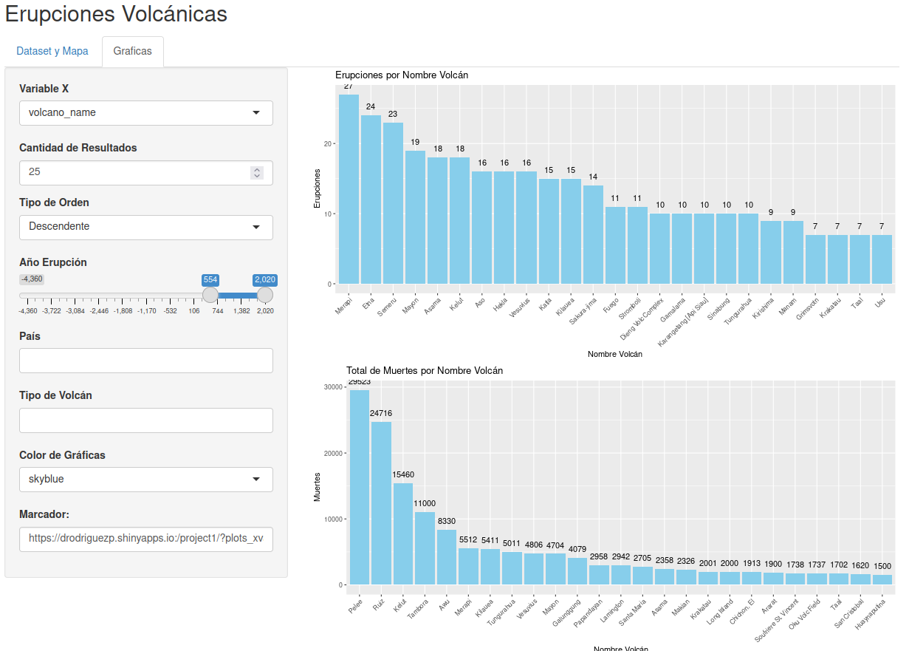
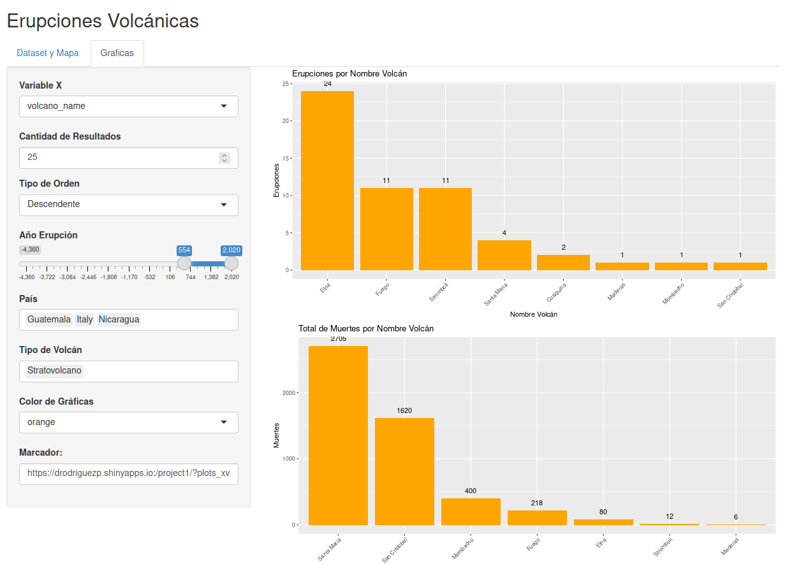
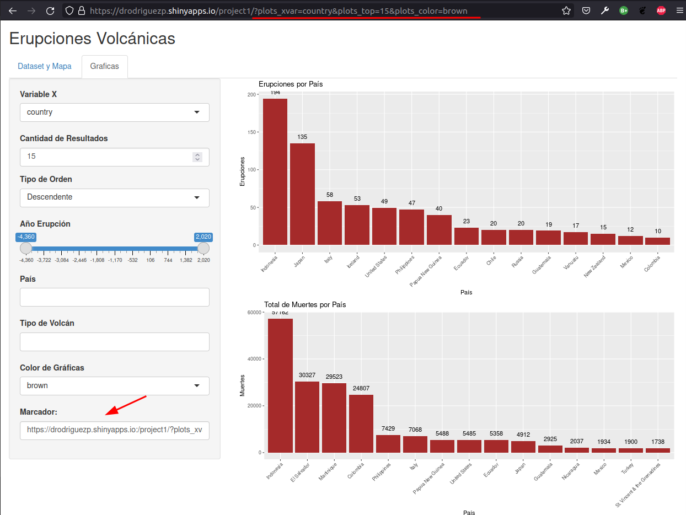

# UNIVERSIDAD GALILEO
### Instituto de Investigación de Operaciones
### Postgrado en Análsis y Predicción de Datos
### Product Development - Proyecto 1
### Antonio Navas, Daniel Rodríguez y Luis Florian
 
## Shiny App
- [Página Principal](https://drodriguezp.shinyapps.io/project1/)
- [Párametros URL](https://drodriguezp.shinyapps.io/project1/?plots_xvar=volcano_name&plots_top=25&plots_color=orange)

### Dashboard de Erupciones Volcánicas

#### Dataset
El dataset contiene registro de activación de volcanes (erupción), desde el primer registro en el año 4,360 AC hasta el año 2,020 DC. Los años AC son represntados como números negativos.  El dataset contiene 14 columnas y 835 filas.

#### Dashboard
El dashboard fue realizado con shiny y presenta dos tabs, i) Dataset y Mapa y ii) Gráficas.

**i) Data Set y Mapa**
- Inicialmente se muestra el dataset completo, visualizado en la misma página con un valor por default de 10 filas.  Esta cantidad se variar entre 10, 25, 50, 100.  Para visualizar el resto es requerido hacer click en opción next, en la parte inferior o elegir el número de página.

- El histograma y el mapa las erupciones de todos los países, pero es posible realizar filtros en la tabla donde se presenta el dataset. Estos filtros se aplicarán tanto en el histograma como el mapa. A continuación se muestra un ejemplo de los resultados obtenidos al filtrar por tipo de volcán.

- Es posible interactuar con el histograma realizando un Brush sobre este, se filtrarán los datos de los países seleccionados. Para eliminar la selección se deberá hacer doble click sobre el histograma.

- En el mapa, los signo + y - son para zoom in y out, respectivamente. 

- Al hacer click en la ubicación marcada en el mapa, se presenta el nombre del volcán.

- El search busca la palabra indicada en todas las variables y grafica inmediatamente el histograma y mapa del resultado de la búsqueda.

**ii) Gráficas**
- Se presentan los histogramas: Erupciones, total de muertes, total de daños en millones de dolares. Como variable X del histograma podemos seleccionar el año, país, nombre de volcán, tipo de volcán o índice de explosividad.

- También podemos variar la cantidad de resultados, ordenarlo por orden ascendente o descendente y elegir un rango específico de años.

- Se puede filtrar los datos de los histogramas por país, tipo de volcán, establecer el color de las gráficas entre 7 opciones de colores.

- Por último se genera una url para visalizar el dashboard por parámetros en la URL. Esta dirección inicia mostrando la pestaña de gráficas.

